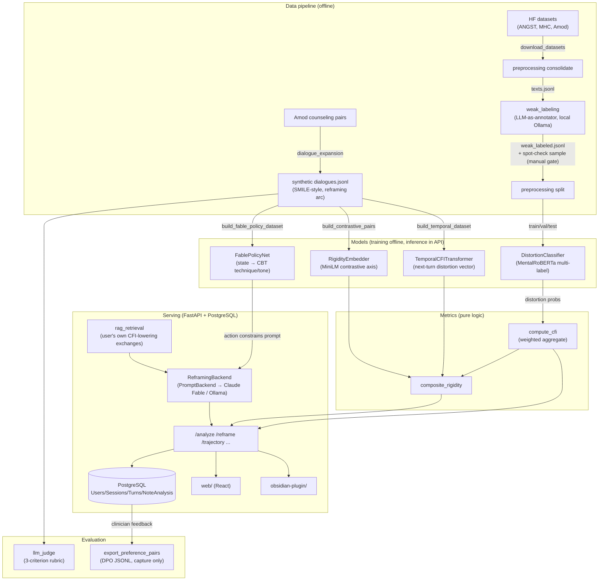

# Architecture — Data Flow & Module Map

High-level map of how data moves through Nausica. Module responsibilities and
constraints live in `CLAUDE.md`; this file is the flow diagram plus the explicit
future-work register.

## Data flow

Key invariants:

- **CFI has one definition** — `compute_cfi()` in
  `src/metrics/cognitive_flexibility_index.py`. Every model that reports a CFI
  (temporal, composite) derives it from there.
- **All LLM calls go through `src/utils/llm_client.py`** — provider per task
  (`ollama` local for bulk weak labeling; `anthropic`/Claude Fable for
  generation and evaluation quality).
- **Raw client text is never persisted for plugin/mobile sources** — only derived
  scores (`NoteAnalysis` stores distortions + CFI + file hash).
- **Config over code** — taxonomy, CFI weights, archetype rules, Fable policy
  mapping, and backend selection all live in `configs/*.yaml`.

## Orchestration

`scripts/run_data_pipeline.sh` runs the Phase 1 chain (download → consolidate →
weak-label → **manual quality gate** → split → train). `--dry-run` caps weak
labeling at 50 rows for a cheap end-to-end smoke test.

## Future work (explicitly out of scope today)

Research roadmap, ordered by when each becomes viable:

1. **Distortion Interaction Network** — learn distortion co-occurrence structure
   (PMI graph) and a graph-aware CFI. Needs real analysis volume for
   statistically meaningful co-occurrence; premature until the classifier has
   been serving real traffic.
2. **Rigidity learning curve** — fit therapy-progress curves to CFI trajectories
   and flag non-responders. Needs real longitudinal sessions, not synthetic
   dialogues.
3. **FablePolicyNet → DPO on clinician feedback** — retrain the Fable policy on
   real preference pairs (`POST /turns/{id}/feedback` →
   `scripts/export_preference_pairs.py`) instead of LLM weak labels.
4. **Cross-cultural adaptation** — culturally weighted taxonomies + multilingual
   encoders. Needs non-English datasets.

Production hardening, deliberately deferred while this is a research prototype:

- Audit logging (who accessed whose data, consent grant/revoke trail)
- GDPR right-to-be-forgotten (soft deletes; today revoking consent hides but
  does not delete)
- Rate limiting per user; monitoring/alerting (metrics export, structured logs)
- pgvector migration for RAG retrieval (docker-compose already ships the
  pgvector image; `rag_retrieval.py` documents the switch — today's Python
  cosine loop is fine below ~1k turns/user)
